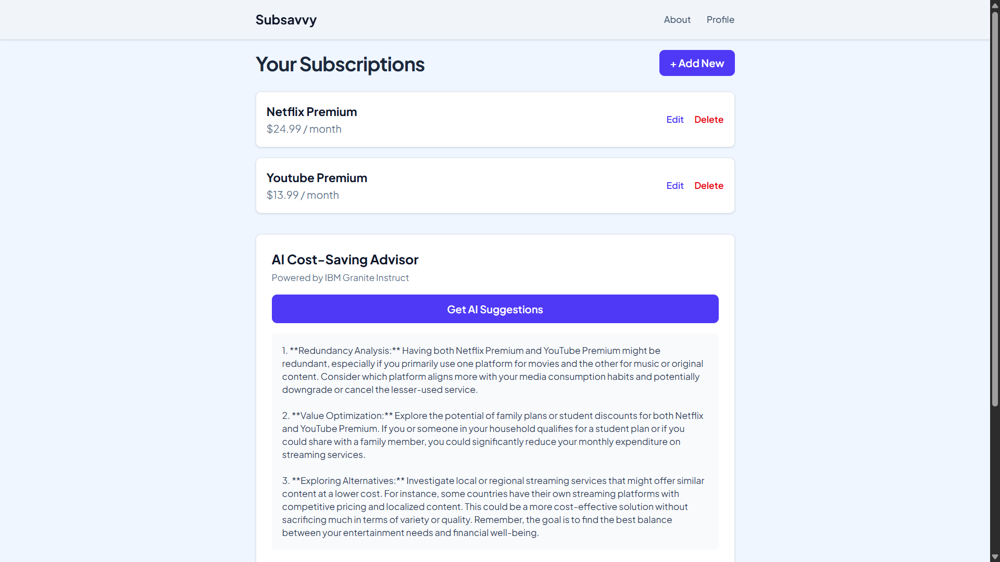
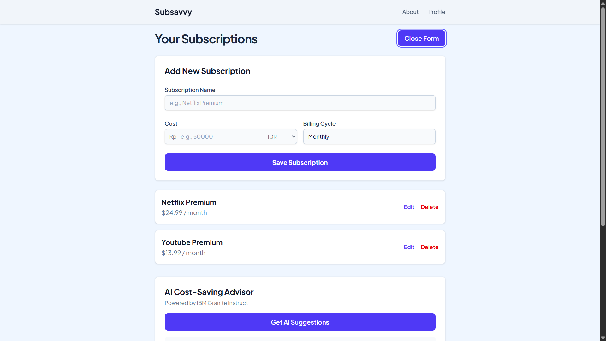
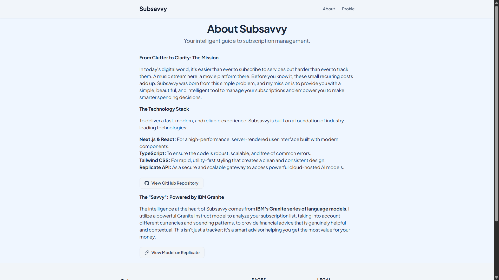
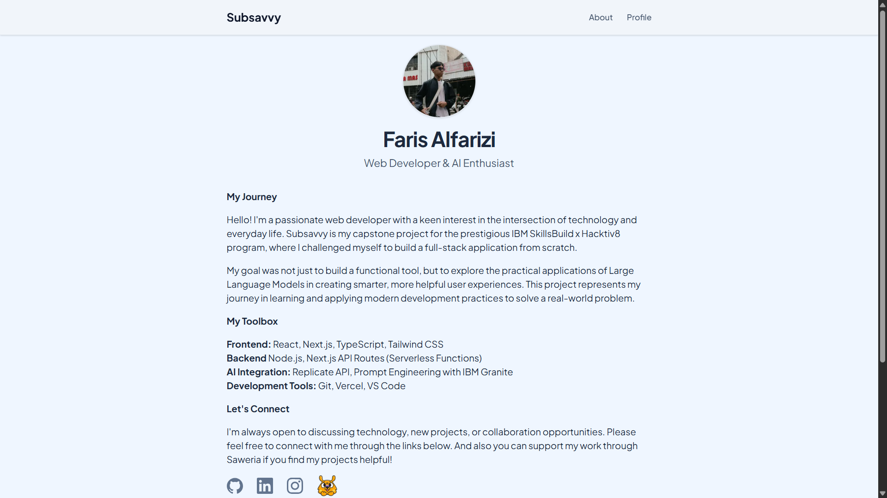
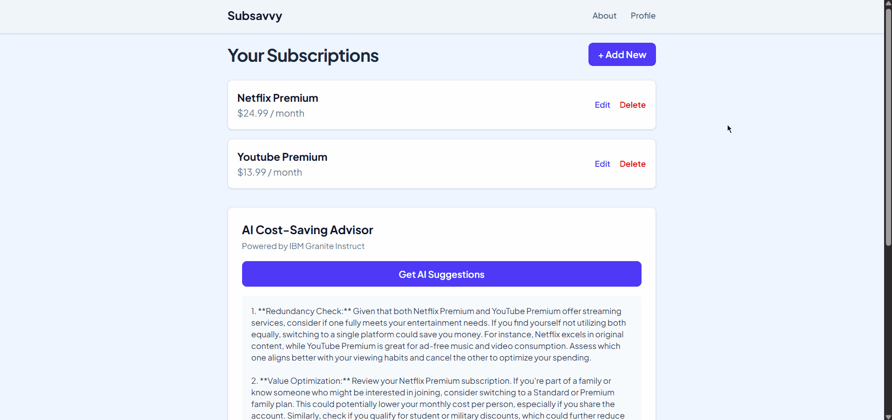
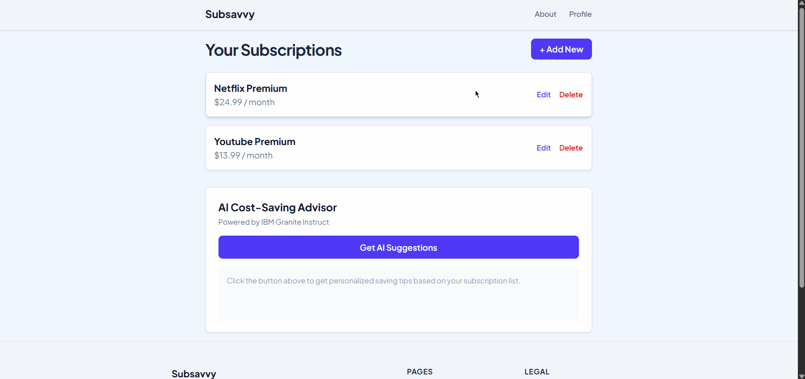
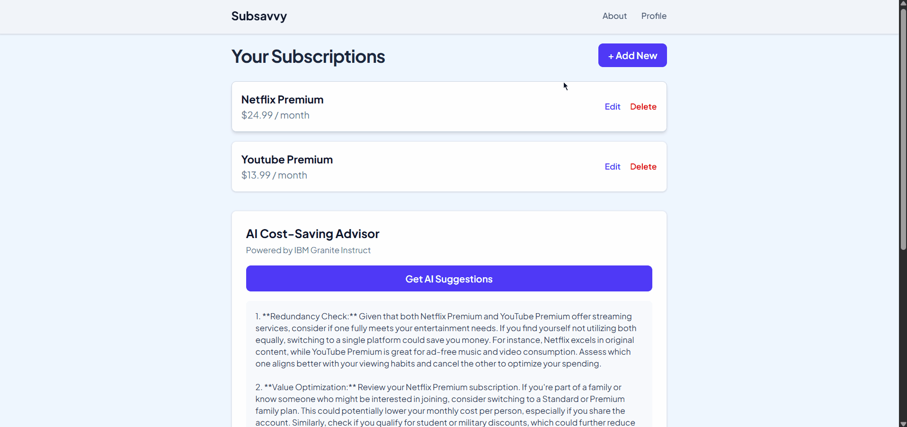

# Subsavvy: AI Subscription Manager

   

### Subsavvy App Screenshots

#### Subsavvy Main View
**
#### Subsavvy CRUD View
**
#### Subsavvy About Page
**
#### Subsavvy Profile Page
**

### Subsavvy App Demos

#### Subsavvy CRUD Demo
**
#### Subsavvy AI Suggestion Demo
**
#### Subsavvy Navigation Demo
**


## 📜 Description

Subsavvy is a smart subscription management application built as a capstone project for the **Student Development Initiative Hacktiv8 x IBM SkillsBuild** program. This app allows users to easily track their recurring digital subscriptions, manage expenses in multiple currencies (IDR & USD), and receive intelligent, personalized saving tips powered by the IBM Granite AI model.

The goal of this project is to create a practical, real-world application that solves a common problem, while also exploring the integration of Large Language Models to create a smarter, more helpful user experience.

## ✨ Features

* ✅ **Full CRUD Functionality:** Easily add, view, edit, and delete subscriptions.
* 💾 **Persistent Storage:** All data is saved securely in the browser's `localStorage`, so your list is always there when you come back.
* 💰 **Multi-Currency Support:** Input and display subscriptions in both Indonesian Rupiah (IDR) and US Dollars (USD).
* 🤖 **AI-Powered Advisor:** A core feature that provides contextual saving tips based on your subscription list, powered by IBM Granite.
* 🧠 **Advanced Prompt Engineering:** The AI can intelligently handle lists with single or mixed currencies, providing the most relevant advice.
* 📄 **Multi-Page Navigation:** Includes Home, About, and Profile pages with seamless, client-side routing.
* 💅 **Modern & Responsive UI:** Built with Tailwind CSS, featuring a professional color palette, custom fonts, and smooth page transitions powered by Framer Motion.

## 🛠️ Technologies Used

* **Framework:** [Next.js](https://nextjs.org/) (React)
* **Language:** [TypeScript](https://www.typescriptlang.org/)
* **Styling:** [Tailwind CSS](https://tailwindcss.com/) with the `@tailwindcss/typography` plugin.
* **Animation:** [Framer Motion](https://www.framer.com/motion/) for page transitions.
* **Notifications:** [React Hot Toast](https://react-hot-toast.com/) for user feedback.
* **Backend API:** Next.js API Routes (Serverless Functions).
* **AI Model:** IBM Granite Instruct (`granite-3.3-8b-instruct`) via the [Replicate](https://replicate.com/) platform.
* **AI Interaction:** The official `replicate` Node.js library.
* **Deployment:** [Vercel](https://vercel.com/).

## ⚙️ Setup Instructions

To run this project locally, follow these steps:

1.  **Clone the repository:**
    ```bash
    git clone [https://github.com/farisalfrz/subscription-tracker-capstone.git](https://github.com/farisalfrz/subscription-tracker-capstone.git)
    cd subscription-tracker-capstone
    ```

2.  **Install dependencies:**
    ```bash
    npm install
    ```

3.  **Set up environment variables:**
    * Create a file named `.env.local` in the root of the project.
    * Add your Replicate API token to this file:
        ```
        REPLICATE_API_TOKEN=r8_xxxxxxxxxxxxxxxxxxxxxxxxxxxxxx
        ```

4.  **Run the development server:**
    ```bash
    npm run dev
    ```
    Open [http://localhost:3000](http://localhost:3000) in your browser to see the result.

## 🤖 AI Support Explanation

Artificial Intelligence (AI) was leveraged in two key ways throughout this project:

### 1. As a Development Assistant (Pair Programmer)

Throughout the development process, I utilized a multi-AI approach to maximize productivity and code quality. For high-level tasks such as brainstorming ideas (app names, features), general debugging assistance, and content writing, I used a general-purpose assistant like Gemini.

For more technical, code-specific tasks, I specifically used the **IBM Granite** model. I leveraged Granite for **code optimization**, for example, by refactoring several functions to be more efficient. Additionally, Granite was instrumental in **implementing clean code principles**, including automatically **generating descriptive comments** and **tidying up indentation** to ensure the code is readable and maintainable. This dual-AI strategy allowed me to accelerate the development process while simultaneously improving the quality and professionalism of the final codebase.

### 2. As an Integrated Core Feature

The main feature of Subsavvy is the "AI Cost-Saving Advisor," which is a direct implementation of the IBM Granite model.
* **Backend Integration:** A secure Next.js API Route (`/api/get-ai-suggestion`) was created to act as a backend. This route receives a prompt from the user's browser, securely adds the secret `REPLICATE_API_TOKEN` on the server-side, and calls the Replicate API.
* **Dynamic Prompt Generation:** The application's front-end dynamically generates a detailed prompt based on the user's current subscription list.
* **Advanced Prompt Engineering:** The prompt is intelligently structured with a specific persona, strict rules, and conditional logic. This ensures the AI provides relevant advice by correctly handling three different scenarios: a list containing only IDR, only USD, or a mix of both. This makes the AI's advice significantly more reliable and useful.

## 🚀 Deployment

This application is deployed on Vercel.

**Live Site:** **[https://subsavvy.farisalfarizi.my.id](https://subsavvy.farisalfarizi.my.id)**